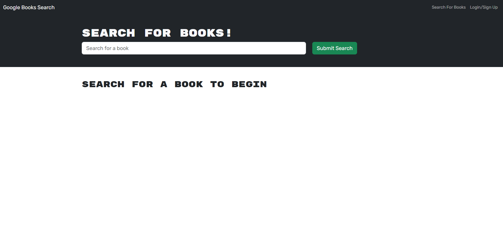

# Book Search

## User Story

```md
AS AN avid reader
I WANT to search for new books to read
SO THAT I can keep a list of books to purchase
```

## Acceptance Criteria

```md
GIVEN a book search engine
WHEN I load the search engine
THEN I am presented with a menu with the options Search for Books and Login/Signup and an input field to search for books and a submit button
WHEN I click on the Search for Books menu option
THEN I am presented with an input field to search for books and a submit button
WHEN I am not logged in and enter a search term in the input field and click the submit button
THEN I am presented with several search results, each featuring a book’s title, author, description, image, and a link to that book on the Google Books site
WHEN I click on the Login/Signup menu option
THEN a modal appears on the screen with a toggle between the option to log in or sign up
WHEN the toggle is set to Signup
THEN I am presented with three inputs for a username, an email address, and a password, and a signup button
WHEN the toggle is set to Login
THEN I am presented with two inputs for an email address and a password and login button
WHEN I enter a valid email address and create a password and click on the signup button
THEN my user account is created and I am logged in to the site
WHEN I enter my account’s email address and password and click on the login button
THEN I the modal closes and I am logged in to the site
WHEN I am logged in to the site
THEN the menu options change to Search for Books, an option to see my saved books, and Logout
WHEN I am logged in and enter a search term in the input field and click the submit button
THEN I am presented with several search results, each featuring a book’s title, author, description, image, and a link to that book on the Google Books site and a button to save a book to my account
WHEN I click on the Save button on a book
THEN that book’s information is saved to my account
WHEN I click on the option to see my saved books
THEN I am presented with all of the books I have saved to my account, each featuring the book’s title, author, description, image, and a link to that book on the Google Books site and a button to remove a book from my account
WHEN I click on the Remove button on a book
THEN that book is deleted from my saved books list
WHEN I click on the Logout button
THEN I am logged out of the site and presented with a menu with the options Search for Books and Login/Signup and an input field to search for books and a submit button
```

## Description

This project consists in a Book Searcg that will allow you to search books save them and delete them from your saved books..

There was no major challenges for me during this project was definitely the refactoring , since i was having multiple naming issues that were causing multiple errors and then getting the console.log for it was hard to know the issues that i was having.

This challenge helped me a lot because it made me to overpass the challengings i was having and becoming more confidence while working under pressure..

- Better use of React
- Higher understanding JavaScript
- Higher understanding Graphql

## Table of Contents

- [Installation](#installation)
- [Usage](#usage)
- [Tests](#tests)
- [License](#license)
- [Questions](#questions)

## Installation

To install the necessary dependencies, run the following command:

```
npm i
```

## Usage

To use this repository is pretty simple. You will have to clone the repo , and soon as you clone it and open it, you will need to open your terminal and run the following command (npm i). After installing everything you will need to run this following command in your terminal run (npm run develop). After running this command you will see your localhost was made and you should be able to access your localhost and open the portfolio. Or you can use the github deployed application instead of the localhost.



Deployed Application: https://book-search-bootcamp-60e5e4f4d6ce.herokuapp.com/

## Tests

I will be listing the tests i have done.

```
Tested - Tested Searching for a Book
Tested - Tested Saving a Book
Tested - Tested Login
Tested - Tested SignUp
Tested - Tested Delete a Book
```

## License


This project is licensed under the MIT license.

## Questions

For any questions or inquiries, feel free to reach out to me:

- GitHub: [DiogoS77](https://github.com/DiogoS77)
- Email: diogo.messi.18@hotmail.com

Deployed Application: https://book-search-bootcamp-60e5e4f4d6ce.herokuapp.com/
